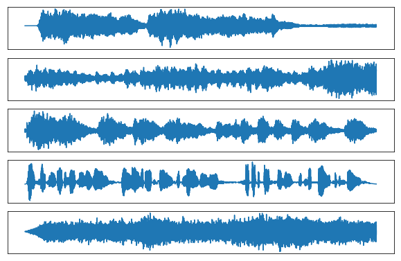
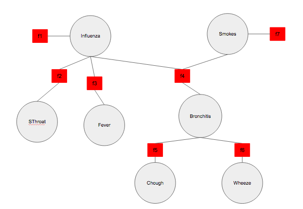
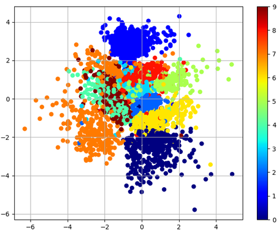
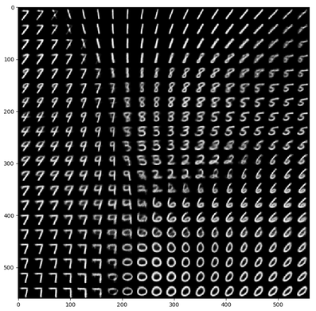

# Machine Learning 2

## Description

Source code for the [Machine Learning 2](http://coursecatalogue.uva.nl/xmlpages/page/2017-2018-en/search-course/course/34043) course at the University of Amsterdam.

### Lab 1 - Independent Component Analysis (ICA)
- [Assignment and Solutions](labs/lab1/lab1_MIRONENCO_WINKENS.ipynb)

   
  <i>Original Audio</i>

   
  <i>Reconstructed Audio using ICA (different order)</i>

### Lab 2 - Sum-Product and Max-Sum Algorithms
- [Assignment and Solutions](labs/lab2/lab2_MIRONENCO_WINKENS.ipynb)

   
  <i>Factor graph</i>

### Lab 3 - Expectation Maximization (EM) and Variational Autoencoders (VAE)
- [Assignment and Solutions](labs/lab3/lab3_MIRONENCO_WINKENS.ipynb)

   

   
  <i>VAE Latent Space</i>

## Dependencies
- jupyter notebook
- Lab 1: SciPy, NumPy, matplotlib
- Lab 2: itertools, NumPy, matplotlib
- Lab 3: gzip, SciPy, torch, matplotlib

## Contributors

- [Mircea Mironenco](https://github.com/danakianfar)
- [Jim Winkens](https://github.com/nom)

## Notice

The code was written for the Machine Learning 2 course taught by Patrick Forré, Max Welling and Joris Mooij at the University of Amsterdam. Please review the <a href="http://student.uva.nl/en/content/az/plagiarism-and-fraud/plagiarism-and-fraud.html">UvA regulations governing Fraud and Plagiarism</a> in case you are a student at the UvA.

